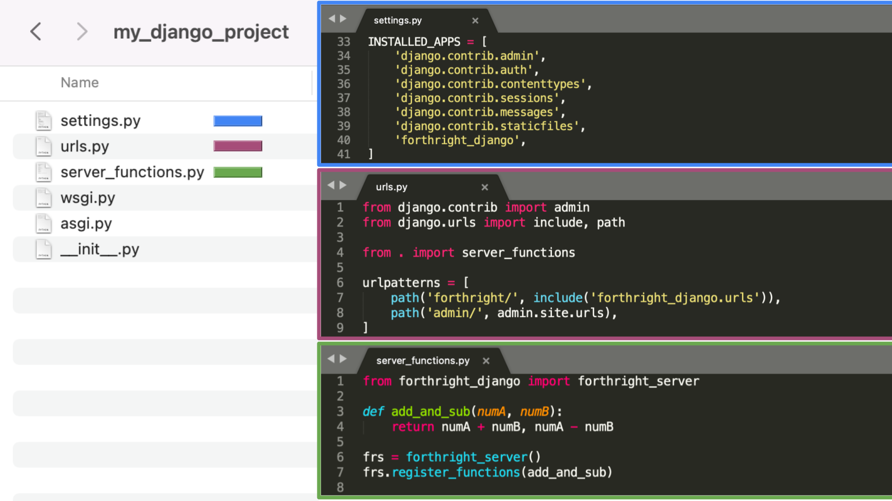

# forthright-django


forthright-django is a Django app to allow developers to directly call server functions from the client. 

## Quick start

1. `pip install -i https://test.pypi.org/simple/ forthright-django`


2. Add forthright-django to INSTALLED_APPS in your django project settings.py:

    ```
    INSTALLED_APPS = [
        ...,
        'forthright_django',
    ]
    ```

3. Include the forthright-django URLconf in your django project urls.py:

    ```
    urlpatterns = [
        path('forthright/', include('forthright_django.urls')),
        ...,
    ]
    ```

4. Instantiate a forthright_server object and export your server functions. For example, place [examples/server_functions.py](./examples/server_functions.py) in your django project folder, and import this file in urls.py

    `from . import server_functions`


5. Now you can instantiate a forthright_client object on the client and directly call the server functions that you exported. For example, [examples/client.py](./examples/client.py)


All together, here's an example django project:

<div float="left">
    
</div>
<br>


## Limitations

You can only pass arguments by value, not by reference. For example, if an argument is a list, the server function will receive a copy of that list.

If an argument is a custom object, the class definition must be present in both the client code and the server code.


